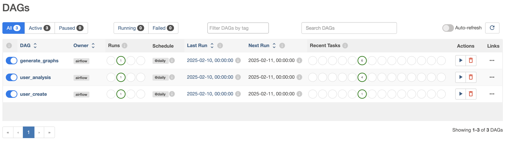
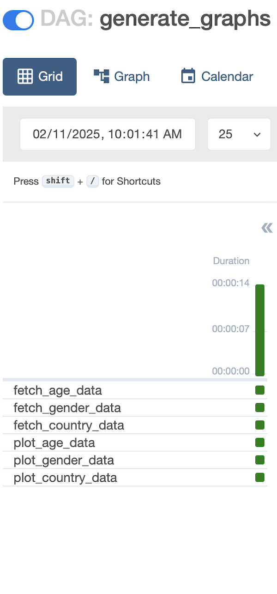
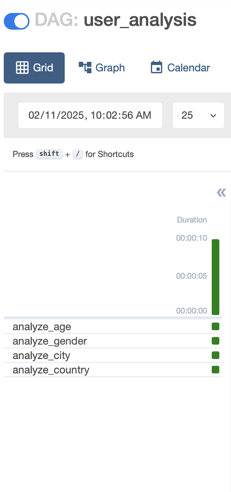
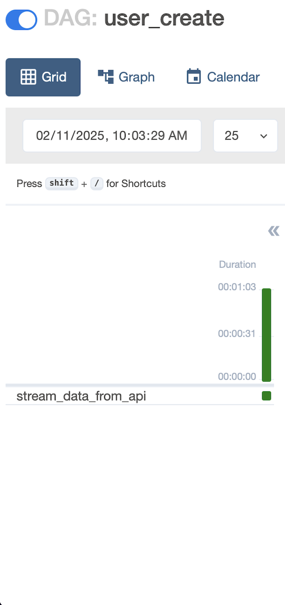
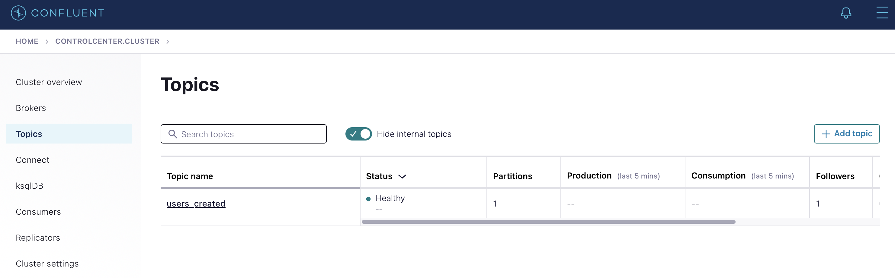
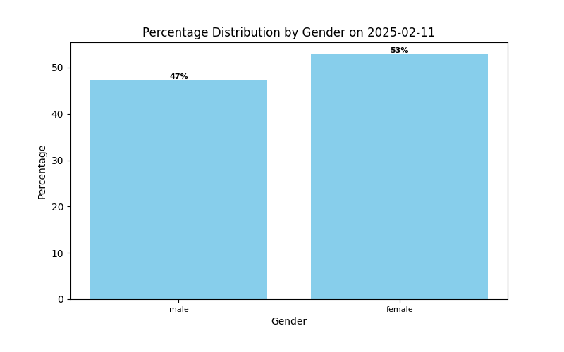
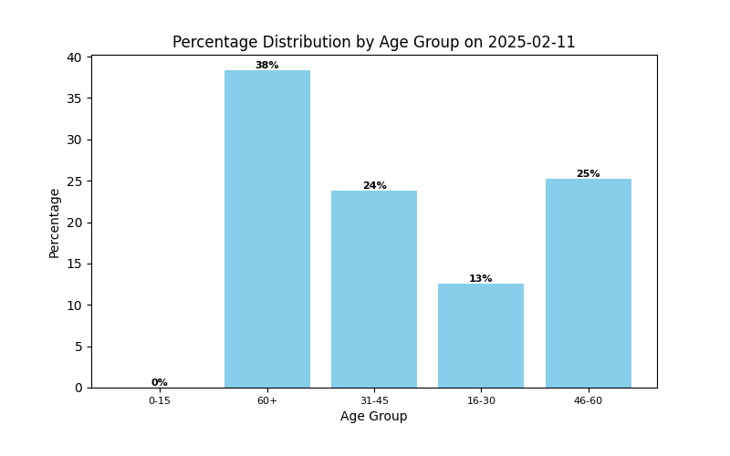
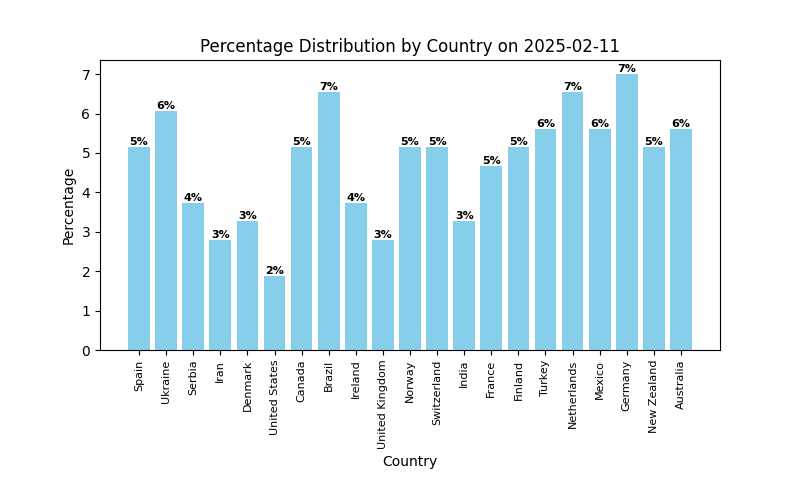

# MemberAnalyzerMaster

Analyze all members and create graphs.

## Project Purpose

- Working with containers in a Docker environment.
- Monitor and analyze users' interactions with web or mobile applications in real-time.

## Project Architecture

### 1. API

The user sends data into the system via an API. In this project, we will send users created with the API.

### 2. Apache Airflow

Airflow is used to orchestrate and manage the data workflow. It processes incoming data from the API and streams it to Kafka.

### 3. PostgreSQL

A relational database used by Airflow to store metadata and workflow execution details.

### 4. Apache Kafka

Kafka acts as the messaging system for streaming data. It receives data from Airflow and distributes it to other components like Spark.

### 5. Apache ZooKeeper

Manages and coordinates Kafka clusters.

### 6. Schema Registry & Control Center

Schema Registry ensures that Kafka messages adhere to predefined schemas, and the Control Center helps manage and monitor Kafka operations.

### 7. Apache Spark

Processes data received from Kafka, applies transformations, and stores results in Cassandra.

### 8. Apache Cassandra

A NoSQL distributed database that stores analyzed user data for further processing and retrieval.

## Data Flow

1. User data is sent via API.
2. Airflow orchestrates and processes the data, sending it to Kafka.
3. Kafka streams the data to Spark for processing.
4. Spark processes and transforms the data.
5. Processed data is stored in Cassandra for further analysis.

## Installation

To set up the project, follow these steps:

```sh
# Clone the repository
git clone https://github.com/Berk-Hatipoglu/MemberAnalyzerMaster
cd MemberAnalyzerMaster

# Build and start the Docker containers
docker-compose up -d
```

## Usage

- Send user data via API.
- Monitor data processing in Apache Airflow.
- Analyze real-time streaming data through Kafka and Spark.
- Retrieve processed data from Cassandra.


## Screenshots

### Airflow DAGs



<div>
  &nbsp;&nbsp;&nbsp;&nbsp;&nbsp;&nbsp;&nbsp;&nbsp;&nbsp;&nbsp;&nbsp;&nbsp;&nbsp;&nbsp;&nbsp;
  &nbsp;&nbsp;&nbsp;&nbsp;&nbsp;&nbsp;&nbsp;&nbsp;&nbsp;&nbsp;&nbsp;&nbsp;&nbsp;&nbsp;&nbsp;
 
</div>


### Control Center Topic




### Graphs

<div>
  &nbsp;&nbsp;&nbsp;&nbsp;
  &nbsp;&nbsp;&nbsp;&nbsp;
 
</div>
